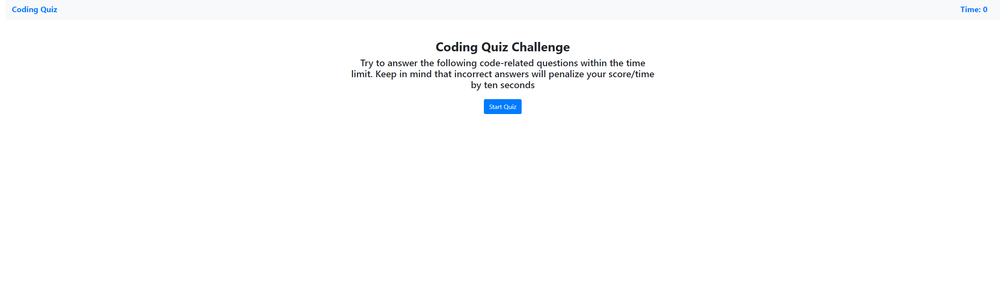
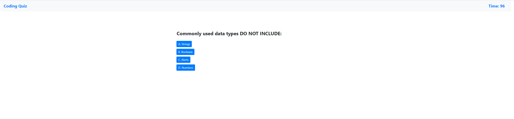
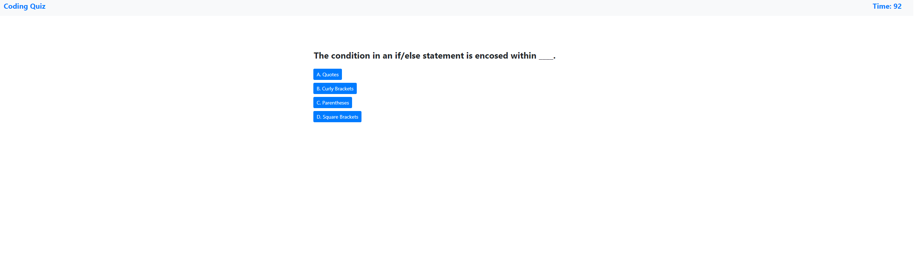
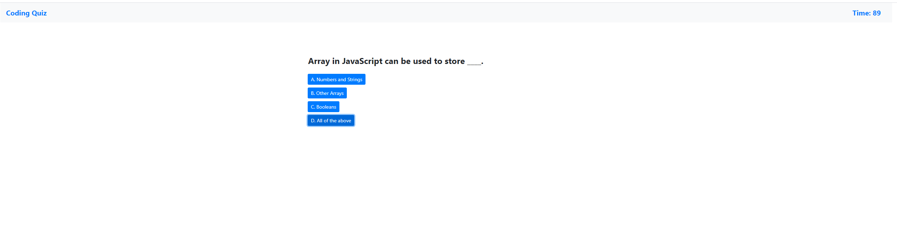
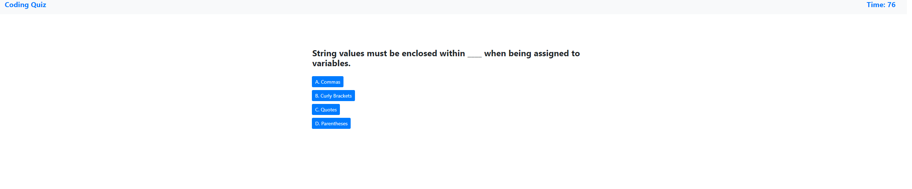
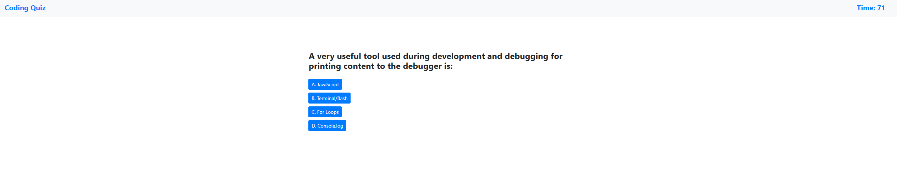
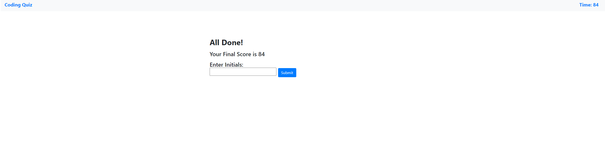
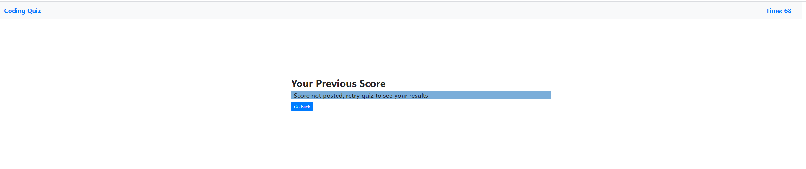
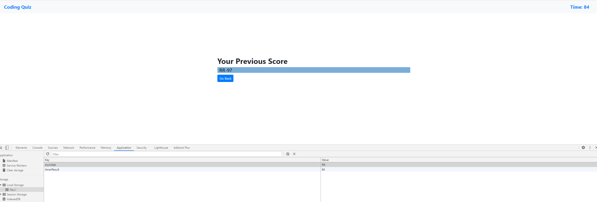

# HMW4
Code Quiz Creation with API Manipulation

## Assignment
Goal is to create a Quiz site with API Manipulation
* Must allow a start button 
    * When clicking starts, a timer goes on
* Must have questions including four multiple choice questions
    * Getting the wrong answer will subtract time by 10 seconds
* When the user completes the quiz or when the timer runs out, the quiz is over
    * The user will be able to put initial and get the scores when the quiz is over
    

## How it works 

When you start up the website you will be greeted with the following statement in the image as well as a button to start up the quiz. The timer will be set at zero until it the 
start button is clicked. If you click on "Coding Quiz" on the top left corner it will take you back to the start, this works during the quiz and after the quiz. 

You will be going through 5 different questions, when you click on one of the four multiple choices only one is correct. If you get the correct answer you will immediately be taken
to the next question, notifying you that you are correct. Getting the wrong answer will do the same, except it will display wrong instead. The timer is set to 100 seconds once the
user clicks the button to start. 10 seconds will be subtracted from the timer if the user gets the question wrong.

Once the user is done with the quiz, the person will put their initials.

If it's the user's first time doing the quiz, it will not display the score and instead it will say to go back and redo it again in order to get the score from the previous quiz.
NOTE: This was made in order to compare the previous score to the current since the current has already been displayed when the user starts typing their initials.

Here is the previous score once the user does the quiz again.

